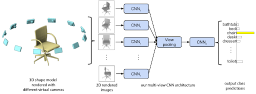
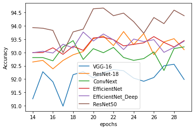
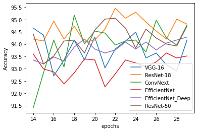

# MVCNN modifications

## Introduction

This project was completed by three contributors (@RonaldErnst, @kolusask, @Icheler) as part of our studies @TUM. It was part of the course Machine Learning for 3D Geometry.

We worked on an addition to [MVCNN][1] by modifying the CNN-layers to more up to date pre-trained networks. In addition we changed the base dataset by merging ['ShapeNet'][2] and ['ModelNet'][3] into a new dataset which we called 'Unified'. Additionally we modified the underlying architecture by modifying the pooling operation and changing its location to see changes in performance.

## Architecture overview



The base model uses a VGG-16 like feature extractor for CNN1. We added multiple different more state of the art pre-trained CNNs to see how much impact the changing of the extraction model has on modelperformance. In addition we also modified the pooling operation from Max-Pooling in all baselines to for example mean-pooling.

Model training performance for stage 1 on ModelNet with shaded images:



Model training performance for stage 2 on ModelNet with shaded images:



|  Architecture  | ModelNet      | Unified |
|:--------:|----------------|--------|
| VGG-16 | 95.03 | 85.37 |
| ConvNext | 95.64 | 85.92 |
| ResNet-18 | 94.95 | 85.86 |
| ResNet-18 with Mean-Pool | 94.75 | 87.30 |

## Installation

The environment.yml file has all the necessary dependencies to train the model yourself if you have [conda][4] installed.

``` bash

conda env create -f environment.yml

```

## How to use the code

The datasets have to be downloaded manually and then prepared using prepare_modelnet/shapenet_data.py from the tools folder.

If wanted you can set up training to use wandb to have an online performance model save.

Then models can be trained using train_mvcnn.py. For arguments used during cli-training please check train_mvcnn.py directly for the most up-to-date version of the CLI arguments.

[1]: https://doi.org/10.48550/arXiv.1505.00880
[2]: https://shapenet.org/
[3]: https://modelnet.cs.princeton.edu/
[4]: https://docs.conda.io/en/latest/